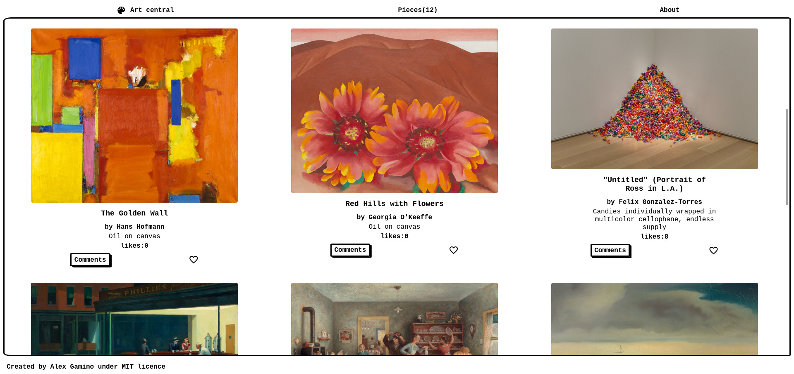

# JS_Capstone
The JavaScript capstone project is about building a web application based on the Art Institute of Chicago API.
All data is preserved thanks to the external [Involvement API](https://www.notion.so/Involvement-API-869e60b5ad104603aa6db59e08150270).

> Website that allows users to view and like artworks, interacting with a remote API.

This is achieved by hitting the Art Institute of Chicago API. Also, the DOM is dynamically modified with JS events.

## Built With

- JavaScript
- HTML5
- CSS3
- Webpack

## Future Updates & Roadmap:

- Add search functionality
- Add commenting functionality
- Allow the user to display more or less artworks

## Getting Started:

To get a local copy up and running follow these simple example steps:

1. Under the repository name, click the Clone or download green button.

2. Copy the URL given by clicking the clipboard button

3. Open a terminal window in your local machine and change the current directory to the one you
   want the clone directory to be made.

4. Type  `git clone` followed by the URL you previously copied to the clipboard

5. Navigate from the current directory to the newly created folder

6. Now open the index.html file on your browser.

#### To test the app locally, use Live Server (Extension for VS Code) to avoid js module CORS policy ####

## Author

👤 **Alex Gamino**

- Github: [@Alex Gamino](https://github.com/AlexHamn)
- Linkedin: [linkedin](https://linkedin.com/in/alex-gamino-81aab3214/)

## 🤝 Contributing

Contributions, issues and feature requests are welcome!

Feel free to check the [issues page](issues/).

## Show your support

Give a ⭐️ if you like this project!

## 📝 License

This project is [MIT](./LICENSE) licensed.
